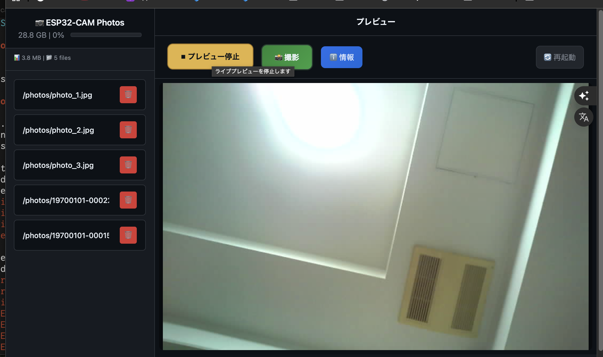

# ESP32-CAM 撮影＆自動テストプロジェクト

このプロジェクトは、ESP32-CAM を Web UI と API で操作し、撮影やファイル管理を行うためのファームウェアとツール群を提供します。撮影結果の簡易検証用スクリプトも同梱しています。

## プロジェクトの構造

```
.
├── Capture/                  # Arduino スケッチと Web アセット
│   ├── Capture.ino
│   └── data/                # SD /data から配信（index.html, style.css, script.js ...）
├── deploy.sh                 # デプロイ（プログラム/ Web アセット）
├── sync.sh                   # Web アセット自動同期
├── utils.sh                  # 接続/SD チェック等のユーティリティ
├── quick_compile.sh          # 高速コンパイル
├── compile_benchmark.sh      # コンパイル速度計測
├── test_capture.py           # 簡易テストスクリプト（レガシー手順）
├── README.md                 # このファイル
└── capture_test_output.jpg   # テスト成功時に生成される画像
```

## 各ファイルの役割

*   `Capture/Capture.ino`: Web サーバー（/app/** API）と静的配信を実装。SD カード `/data` から Web UI を提供し、撮影は `POST /app/capture`（JSON）で実行、画像は `GET /app/photo?name=` で取得します。ファイル一覧 `/app/files`、削除 `/app/delete`、ストリーム `/app/stream`、ハードウェア情報 `/app/hardware` などを提供。
*   `test_capture.py`: シリアルから IP を取得し撮影を検証する簡易テスト。現在の実装では `/app/capture`（JSON）→ `/app/photo` のフロー推奨のため、スクリプトは用途に応じて調整してください。
*   `deploy.sh` / `sync.sh`: プログラム/ Web アセットのデプロイ・同期を行います。

## 必要なもの

*   AI-Thinker ESP32-CAM
*   PCとの接続用のUSB-シリアル変換アダプタ
*   Python 3（任意: `test_capture.py` 実行用）
*   `arduino-cli`

## セットアップ

1.  **ハードウェアの接続:**
    ESP32-CAMをPCに接続します。

2.  **Arduino-cliの設定:**
    `arduino-cli`がインストールされ、`esp32`ボードパッケージが追加されていることを確認してください。

3.  **Pythonライブラリのインストール（任意）:**
    テストスクリプトに必要なライブラリをインストールします。

    ```bash
    pip install pyserial requests Pillow
    ```

4.  **設定ファイルの確認:**
    *   `Capture/Capture.ino`: `ssid`と`password`を、お使いのWi-Fi環境に合わせて変更してください。
    *   `upload_capture.sh`: `SERIAL_PORT`を、お使いの環境に合わせて変更してください。
    *   `test_capture.py`: `SERIAL_PORT`と`WIFI_SSID`を、お使いの環境に合わせて変更してください。

## テストの実行手順

1.  **デプロイ:**
    `deploy.sh` を使ってプログラムと Web アセットをデプロイします。

    ```bash
    ./deploy.sh <ESP32_IP> [/dev/cu.usbserial-XXXX]
    ```

2.  **（任意）簡易テスト:**
    `test_capture.py` は旧来の `/capture` を前提としています。現行は `POST /app/capture`（JSON）→ `GET /app/photo` のフローです。必要に応じてスクリプトを調整してご利用ください。

## 動作例（Web UI）

以下は Web UI の画面例です。ESP32-CAM の IP アドレスにブラウザでアクセスし、ライブプレビューの開始/停止、撮影、ファイル一覧/削除、再起動などが行えます。



別画面例:


使い方の流れ（例）:

* トップページ（/）へアクセス
* ライブプレビューを開始（停止も可）
* 「撮影」→ 完了後に一覧へ反映
* 一覧から写真をクリックして表示（`/app/photo?name=`）
* 不要な写真は削除（`/app/delete`）
* 必要に応じてデバイス再起動（`/app/reboot`）
* 情報ダイアログ（ハードウェア情報/SDカード情報）を開いて状態を確認
